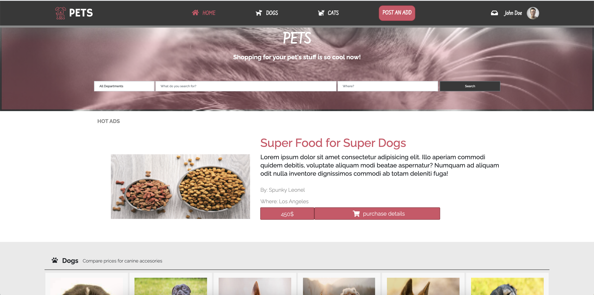

# Pets - almost everything related for pet care.

> Corresponds to the capstone project of HTML module. THis project has two pages of a eCommerce website about domestic pet accesories.

In this project, I created an online shop according to a client's specifications of colors, fonts, layout, and deadlines established before.

## Built With

- HTML & CSS
- Bootstrap
- Grid
- Flex-box

## Live Demo

[Live Demo Link](https://memelopez.github.io/wk4-capstone/)

[Presentation Video](https://www.loom.com/share/36dac568cc4d4f358cf3bd0a90481066)

## Authors

👤 **Elmer Lopez**

- GitHub: [@memelopez](https://github.com/memelopez/)
- Twitter: [@memelopez10](https://twitter.com/memelopez10)
- LinkedIn: [Elmer Lopez](https://www.linkedin.com/in/elmer-lopez-51b187200/)

## 🤝 Contributing

Contributions, issues, and feature requests are welcome!

## Show your support

Give a ⭐️ if you like this project!

## 📝 License

This project is [MIT](https://opensource.org/licenses/MIT) licensed.

## Credits

Copyright© 2021 Zattix.com. All Rigths Reserved. Designed copied from Mohammed Awad.
